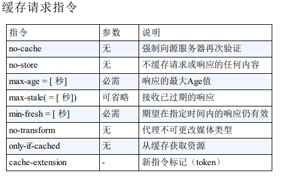
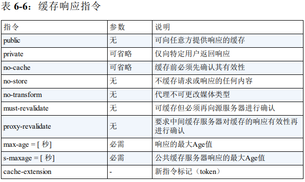

###  TCP/IP 协议族
>计算机与网络设备要相互通信，双方就必须基于相同的方法。比如，如何探测到通信目标、由哪一边先发起通信、使用哪种语言进行通信、怎样结束通信等规则都需要事先确定。不同的硬件、操作系统之间的通信，所有的这一切都需要一种规则。而我们就把这种规则称为协议（protocol）。TCP/IP 是互联网相关的各类协议族的总称

#### TCP/IP 的分层管理

1. 应用层  
  - FTP（File
Transfer Protocol，文件传输协议）
- DNS（Domain Name System，域
名系统）
- HTTP
2. 传输层  
- TCP（Transmission Control
Protocol，传输控制协议）
-  UDP（User Data Protocol，用户数据报
协议）

TCP（传输控制协议）是一种面向连接的、可靠的、基于字节流的传输层通信协议。它在因特网协议族（TCP/IP协议族）中担任主要的传输协议，为许多应用程序（如Web浏览器和电子邮件客户端）提供可靠的数据传输服务。

TCP的主要特点包括：

1. 面向连接：在传输数据之前，TCP需要通过“三次握手”过程建立连接。一旦连接建立，数据可以在两个方向上传输。
2. 可靠传输：TCP提供可靠的数据传输服务，通过使用确认、超时和重传等机制，确保数据包的顺序和完整性。
3. 字节流：TCP将数据看作字节流，一个个字节以特定的顺序传输。这意味着数据可以在不同的数据段中发送，并且接收方需要重新组装这些数据段以获取完整的数据。
4. 流量控制：TCP使用滑动窗口机制进行流量控制，根据接收方的接收能力调整发送速率。
5. 拥塞控制：TCP通过使用拥塞控制算法（如慢开始、拥塞避免、快重传和快恢复）来避免网络拥塞。当检测到网络拥塞时，发送方会减慢发送速率，以降低数据包丢失的风险。
6. 传输层协议：TCP是传输层协议，位于OSI模型中的第五层（会话层之下，应用层之上）。它负责将数据分段并提供端到端的数据传输服务。

>TCP的应用非常广泛，包括Web浏览器、电子邮件、文件传输协议（FTP）、远程登录协议（Telnet）等。这些应用程序依赖于TCP提供可靠的数据传输服务，以实现数据的准确传输和顺序排列。
3. 网络层  
4. 数据链路层  

### http状态码
- 204
 >该状态码代表服务器接收的请求已成功处理，但在返回的响应报文中不含实体的主体部分。另外，也不允许返回任何实体的主体。比如，当从浏览器发出请求处理后，返回 204 响应，那么浏览器显示的页面不发生更新。
 场景: 1. 保存表单编辑内容 2.代替部分200,节省流量数据
 - 206
 - 301 永久重定向
 - 302 307 临时重定向
 > 如果将一个网址保存为书签、如果网址永久重定向则重新访问时书签会自动更新，而302则不会
 - 303 
 > 303 状态码明确表示客户端应当采用 GET 方法获取资源，
- 304
- 400 Bad Request
- 401
>该状态码表示发送的请求需要有通过 HTTP 认证（BASIC 认证、DIGEST 认证）的认证信息。外若之前已进行过 1 次请求，则表示用户认证失败.当浏览器初次接收到 401 响应，会弹出认证用的对话窗口。
- 403 Forbidden
- 500 该状态码表明服务器端在执行请求时发生了错误
- 503 

### HTTP 首部字段结构
#### 通用首部字段
1. Cache-Control

  - no-cache
  >客户端发送的请求中如果包含 no-cache 指令，“中间”的缓存服务器必须把客户端请求转发给源服务器
  > Cache-Control: no-cache=Location 
  > 由服务器返回的响应中，若报文首部字段 Cache-Control 中对 no-cache
  字段名具体指定参数值，那么客户端在接收到这个被指定参数值的首
  部字段对应的响应报文后，就不能使用缓存。换言之，无参数值的首
  部字段可以使用缓存。只能在响应指令中指定该参数。
  - no-store 
  - s-maxage max-age
  > s-maxage 指令的功能和 max-age 指令的相同，它们的不同点是 smaxage 指令只适用于供多位用户使用的公共缓存服务器
  >HTTP/1.1 版本的缓存服务器遇到同时存在 Expires 首部字段的情况时，会优先处理 max-age 指令，而忽略掉 Expires 首部字段。而HTTP/1.0 版本的缓存服务器的情况却相反，max-age 指令会被忽略掉。
  - min-fresh 
  > min-fresh 指令要求缓存服务器返回至少还未过指定时间的缓存资源
  - max-stale
  > 使用 max-stale 可指示缓存资源，即使过期也照常接收。如果指令未指定参数值，那么无论经过多久，客户端都会接收响应；如果指令中指定了具体数值，那么即使过期，只要仍处于 max-stale指定的时间内，仍旧会被客户端接收。
  - only-if-cached
  > 缓存服务器不重新加载响应，也不会再次确认资源有效性。若发生请求缓存服务器的本地缓存无响应，则返回状态码 504 Gateway Timeout。
  - must-revalidate
  >使用 must-revalidate 指令会忽略请求的 max-stale 指令
  - proxy-revalidate
  - no-transform
  > 指令规定无论是在请求还是响应中，缓存都不能改变实体主体的媒体类型。这样做可防止压缩图片等类似操作。
  - Date
  > Date 表明创建 HTTP 报文的日期和时间
  - Transfer-Encoding
    Transfer-Encoding的可选值包括：
    1. chunked：将数据切割成一系列的块数据传输。通常会对数据内容进行一些压缩编码操作。
    2. identity：传输时不做任何处理，以自身的本质数据形式传输。通常对传传输采用分块策略之类的方式。
  - Upgrade
  > 用于检测 HTTP 协议及其他协议是否可使用更高的版本进行通信
  - Via
  > Via 是为了追踪客户端与服务器之间的请求和响应报文的传输路径
  - If-Match
  > 只有当 If-Match 的字段值跟 ETag 值匹配一致时，服务器才会接受请求。服务器会比对 If-Match 的字段值和资源的 ETag 值，仅当两者一致时，才会执行请求。反之，则返回状态码 412 Precondition Failed 的响应。还可以使用星号（*）指定 If-Match 的字段值。针对这种情况，服务器将会忽略 ETag 的值，只要资源存在就处理请求。
  - If-Modified-Since
  > 浏览器在发送HTTP请求时，会把浏览器端缓存页面的最后修改时间一起发到服务器去，服务器会把这个时间与服务器上实际文件的最后修改时间进行比较。如果时间一致，那么返回HTTP状态码304（不返回文件内容）,和Last-Modified 搭配使用

