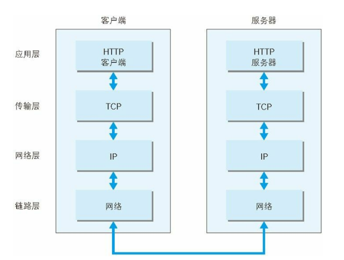

###  TCP/IP 协议族
>计算机与网络设备要相互通信，双方就必须基于相同的方法。比如，如何探测到通信目标、由哪一边先发起通信、使用哪种语言进行通信、怎样结束通信等规则都需要事先确定。不同的硬件、操作系统之间的通信，所有的这一切都需要一种规则。而我们就把这种规则称为协议（protocol）。TCP/IP 是互联网相关的各类协议族的总称

#### TCP/IP 的分层管理

1. 应用层  
  - FTP（File
Transfer Protocol，文件传输协议）
- DNS（Domain Name System，域
名系统）
- HTTP
2. 传输层  
- TCP（Transmission Control
Protocol，传输控制协议）
-  UDP（User Data Protocol，用户数据报
协议）

TCP（传输控制协议）是一种面向连接的、可靠的、基于字节流的传输层通信协议。它在因特网协议族（TCP/IP协议族）中担任主要的传输协议，为许多应用程序（如Web浏览器和电子邮件客户端）提供可靠的数据传输服务。

TCP的主要特点包括：

1. 面向连接：在传输数据之前，TCP需要通过“三次握手”过程建立连接。一旦连接建立，数据可以在两个方向上传输。
2. 可靠传输：TCP提供可靠的数据传输服务，通过使用确认、超时和重传等机制，确保数据包的顺序和完整性。
3. 字节流：TCP将数据看作字节流，一个个字节以特定的顺序传输。这意味着数据可以在不同的数据段中发送，并且接收方需要重新组装这些数据段以获取完整的数据。
4. 流量控制：TCP使用滑动窗口机制进行流量控制，根据接收方的接收能力调整发送速率。
5. 拥塞控制：TCP通过使用拥塞控制算法（如慢开始、拥塞避免、快重传和快恢复）来避免网络拥塞。当检测到网络拥塞时，发送方会减慢发送速率，以降低数据包丢失的风险。
6. 传输层协议：TCP是传输层协议，位于OSI模型中的第五层（会话层之下，应用层之上）。它负责将数据分段并提供端到端的数据传输服务。

>TCP的应用非常广泛，包括Web浏览器、电子邮件、文件传输协议（FTP）、远程登录协议（Telnet）等。这些应用程序依赖于TCP提供可靠的数据传输服务，以实现数据的准确传输和顺序排列。
3. 网络层  
4. 数据链路层  

### http状态码
- 206 
 >该状态码代表服务器接收的请求已成功处理，但在返回的响应报文中不含实体的主体部分。另外，也不允许返回任何实体的主体。比如，当从浏览器发出请求处理后，返回 204 响应，那么浏览器显示的页面不发生更新。
 场景: 1. 保存表单编辑内容 2.代替部分200,节省流量数据
 - 206
 - 301 永久重定向
 - 302 临时重定向
 > 如果将一个网址保存为书签、如果网址永久重定向则重新访问时书签会自动更新，而302则不会
 - 303 
 > 303 状态码明确表示客户端应当采用 GET 方法获取资源，
