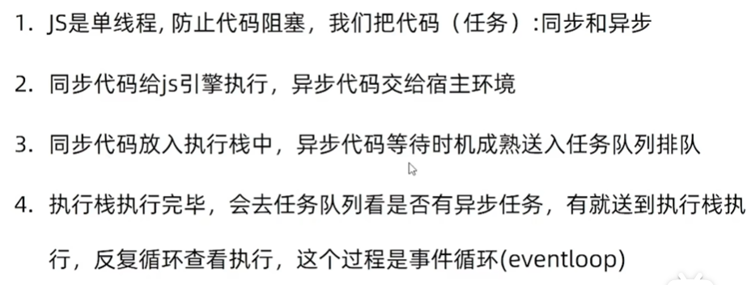
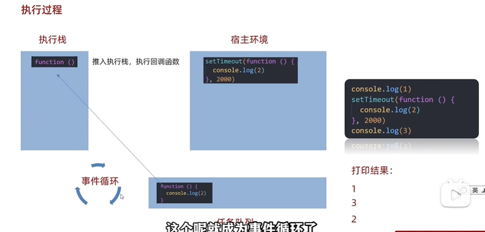
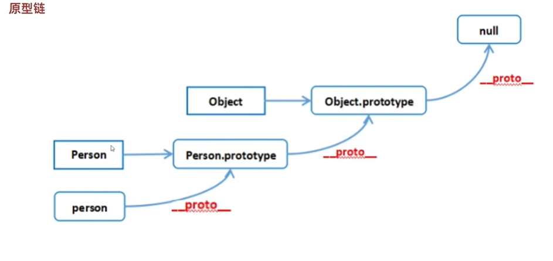

### 问题
 - ⼀些常见问题自我介绍
- 面试完你还有什么问题要问的吗
- 你有什么爱好?
- 你最大的优点和缺点是什么?
- 你为什么会选择这个⾏业， 职位?
- 你觉得你适合从事这个岗位吗?
- 你有什么职业规划?
- 你对⼯资有什么要求?
- 如何看待前端开发？
- 未来三到五年的规划是怎样的？
- 你的项目中技术难点是什么？遇到了什么问题？你是怎么解决的？你们部门的开发流程是怎样的
- 你认为哪个项目做得最好？
- 说下⼯作中你做过的⼀些性能优化处理
- 最近在看哪些前端方面的书？
- 平时是如何学习前端开发的？
- 你最有成就感的⼀件事
- 你为什么要离开前⼀家公司？
- 你对加班的看法
- 你希望通过这份⼯作获得什么

## JS的构造函数
### &emsp;&emsp; 在es6之前，js没有类的概念，js通过引入构造函数来定义对象和对象的属性

## JS中的call apply bind
### 用法
- fn.call(this, 'a','b','b')
- fn.apply(this, ['a','b','c'])
- fn.bind(this, ['a','b',''c])
- bind不会立即执行，而是返回一个函数。这样调用的时候不必重复绑定调用

### 高级应用

## 箭头函数与普通函数的区别
 箭头函数的this指向它定义的环境，而普通函数的this指向它执行的环境

 ## 原始类型和引用类型的区别
 - 赋值的区别 原始类型是直接赋值，引用类型是赋【引用】
 - 比较 原始类型比较是比较值是否相等，引用类型是比较引用是否相等
 - 函数传参 原始类型是值传参，函数是引用传参

 ## 闭包
 ```js
 const fn = () => {
  let count = 0;
  const function fnc() {
    count ++;
  };
  return fnc;
 }
```
  闭包=内层函数+引用的外层函数变量
  ### 作用
  - 封装函数: 如计算圆周率，可以把Π定义在函数内
  - 变量私有化: hooks
  ### 内存泄漏
  const result = fn();
  如果fn里面引用到了变量，而result 作为全局变量是一直存在的(除非关闭页面)，则会导致fn中的变量一直得不到销毁

  ## eventloop(事件循环)
  
   [js机制](https://juejin.cn/post/7002037475874963493)  

   
     
   ### 微任务(micro task)(由js引擎发起)
- promise(promise本身是同步，是then、catch为异步任务)
- async
- await
- process.nextTick(node)
- mutationObserver(html5新特性)  
### 宏任务(macro task)(由宿主环境发起，如node、浏览器)
- script(整体代码)
- setTimeout
- setInterval
- setImmediate
- I/O
- UI render

## 防抖(debounce)节流(throttle)
### 防抖应用场景
   - 搜索框输入
   - 文本编辑器保存
### 节流应用场景
   - 鼠标移动、窗口变化、滚动等频繁触发的事件
   - 记录视频播放时间


## 原型、原型链
定义： 每一个函数都有prototype属性，这个属性就是原型; 每个对象都有__proto__属性，它是指向原型对象
```js
const arr = new Array(1,2,3)
arr.__proto__ === Array.prototype
```
   
作用： 
- 存放一些属性和方法
- 在javaScript中实现继承

## React hooks

```js
useState简单实现

const MyReact = (() => {
  const state = [];
  const stateSetter = [];
  let stateIndex = 0;

  const creatState = (stateIndex, iniState) => {
    return state[stateIndex] = state[stateIndex] === undefined ? iniState : state[stateIndex];
  }

  const creatStateSetter = (stateIndex) => {
    if(!stateSetter[stateIndex]) {
      const setState = (newState) => {
        if(typeof(newState) === 'function') {
          state[stateIndex] = newState(state(stateIndex));
        } else {
          state[stateIndex] = newState;
        }
        render();
      };
      stateSetter[stateIndex] = setState;
    }
    return stateSetter[stateIndex];
  }

  const render = () => {
    stateIndex = 0;
    ReactDom.render(
      <App />,
      document.querySelector('#app')
    )
  }

  const useState = (iniState) => {
    const _state = creatState(stateIndex, iniState);
    const _setState = creatStateSetter(stateIndex);
    stateIndex ++;
    return [_state, _setState];
  }

  return useState;
})();

useEffect

const MyReact = (() => {
  const callbackArr = [];
  const depArr = [];
  let index = 0;

  const useEffect = (callback, dep) => {
    if(typeof(callback) !== 'function') {
      throw new TypeError('回调函数必须是函数！');
    };
    if(dep!== undefined && !Array.isArray(dep)) {
      throw new TypeError('依赖必须是数组结构！');
    };
    const isChange = depArr[index] ? depArr[index].some((dep, index) => dep !== dep[index]) : true;

    if(isChage) {
      callback();
    };
    depArr[index] = dep;
    index++;
  };
  return useEffect
})();
```
